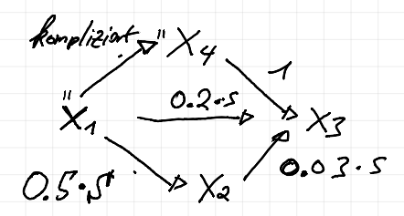

### Files

####  image_dag_wo_image.R
In this file the DAG is created with a variable $X_4$ instead of the image, which can be used in `colr`. In detail:
This model fits the following DAG. In which the data is generated as:

- $X_1$ Complicated function from the labels of the image
- $X_4$ Complicated function of $X_1$
- $U_2 = h(X_2) + \beta_{21} X_1$ with $U_2$ coming from a standard Logistic $U_2 \sim L(0,1)$ 
- $U_3 = h(X_3) + \beta_{31} X_1 + \beta_{32} X_2 + \beta_{34} X_4$ with $U_2$ coming from a standard Logistic $U_2 \sim L(0,1)$ 

This construction allows to estimate the effects, the $\beta$s using the Colr package.

##### Status 👍
  - Both `Colr` and the DAG transformation model produce the correct results (for $S=10$) 
  
  
####  image_dag.R
